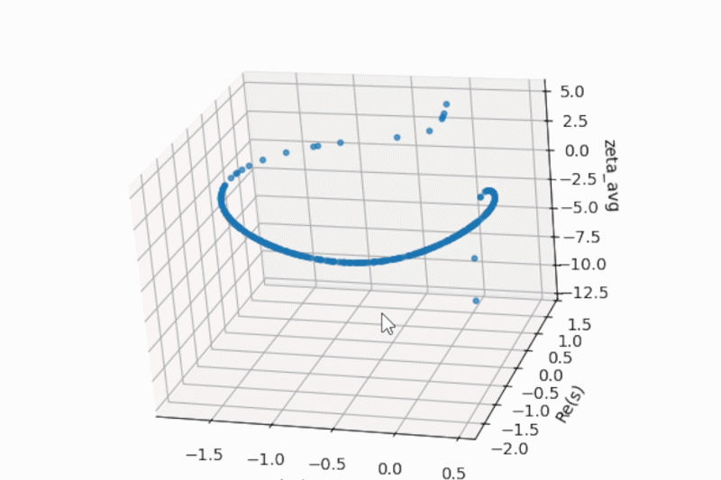
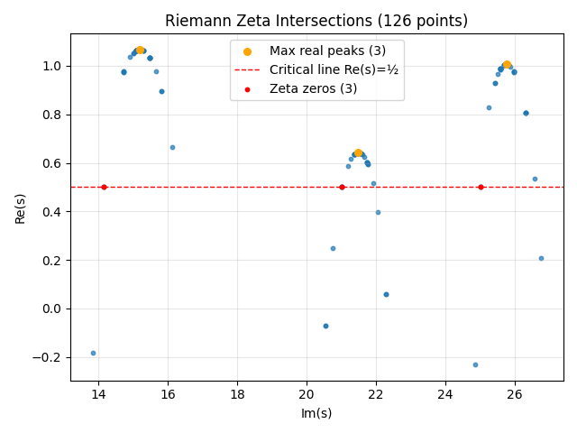

# zetaExplorer

**zetaExplorer** maps the intersections where the real and imaginary parts of the Riemann zeta function are equal — all points *s* in the complex plane where Re(ζ(s)) = Im(ζ(s)). It can chart broad regions of these intersections, follow the complicated curves they form deep into the complex plane, and focus a search on any rectangular region of interest.

Four algorithms are available: a **circle search** that fans outward from a starting point to document big or small details, a **box search** that confines the circle search to a user-defined rectangular region, a **Columbus search** that follows a single continuous curve as far as you set it to go, and a **find max real** algorithm that locates the point with the highest real part near a given starting point.

---

## Why this tool exists

The intersections where Re(ζ(s)) = Im(ζ(s)) are not scattered randomly — they form individual, continuous curves that run through the complex plane. zetaExplorer is built to collect data on those curves: mapping their shapes, tracing them individually, and surveying specific regions in detail.

The goal behind that data collection is to find equations that describe individual curves. An equation that correctly describes one of these curves would, by definition, produce points where Re(ζ(s)) = Im(ζ(s)) when fed into the zeta function. If enough of those equations could be found and understood, they could bring us closer to a numerical resolution of the Riemann hypothesis.

---

## Installation

```bash
pip install git+https://github.com/JDvorak1/Zeta-intersect-explorer.git
```

## Update

```bash
pip install --upgrade git+https://github.com/JDvorak1/Zeta-intersect-explorer.git
```


---

## Contents

- [The Riemann-zeta fingerprint](#the-riemann-zeta-fingerprint)
- [The zeta egg](#the-zeta-egg)
- [Single curves](#single-curves)
- [Box search](#box-search)
- [Non-trivial peaks](#non-trivial-peaks)
- [API reference](#api-reference)
- [File structure](#file-structure)

---

## The Riemann-zeta fingerprint

Running a broad circle search from a central seed reveals the fingerprint of the Riemann zeta function. From these points, it's already possible to see the curves.


Produced with [`examples/map_explorer.py`](examples/map_explorer.py):

```python
import zetaExplorer

results = zetaExplorer.run("circleSearch", starting_point=(-10, 0),
                           radius_range=(5, 10), rounds=50, precision=250)
# refine
results = zetaExplorer.run("circleSearch", seed_results=results,
                           radius_range=(0.25, 0.5), rounds=25, precision=250)
results.plot_intersects()
```

Each visible curve is a structure of the intersections. Different regions of the complex plane show different structures:


---

## The zeta egg

Near the trivial zero at (−2, 0) the intersection curve closes into a loop.


3d plot of the zeta egg.



Produced with [`examples/eggsplorer.py`](examples/eggsplorer.py):

```python
import zetaExplorer

results = zetaExplorer.run("circleSearch", starting_point=(-2, 0),
                           radius_range=(0.5, 1.5), rounds=5,
                           circles_per_round=25, precision=250)

results.plot_intersects()
results.plot_3d()
```

---

## Single curves

The **Columbus search** (`columbusSearch`) works differently from the circle search. Instead of spreading outward in all directions, it always steps toward the point farthest from the starting location.

This makes it well-suited for tracing complicated, winding curves inside the Riemann plane without losing the thread.


Curve starting at (-4,0)


Produced with [`examples/single_curve.py`](examples/single_curve.py):

```python
import zetaExplorer

starting_point = (-4, 0)

down_search = zetaExplorer.run("columbusSearch", starting_point=starting_point,
                                direction="down")
up_search   = zetaExplorer.run("columbusSearch", starting_point=starting_point,
                                direction="up")

results = down_search + up_search

# optional: fill in gaps with circle search
results = zetaExplorer.run("circleSearch", seed_results=results)

results.to_csv("intersections.csv")
results.plot_intersects()
```
Curve starting at the first zero on the critical line.


---

## Box search

The **box search** (`boxSearch`) runs a circle search constrained to a rectangular region of the complex plane defined by two corner points. Random circles are placed uniformly within the box, making it easy to survey a specific area without the search drifting outside it.

This is useful when you want to focus on a known region — for example, the critical strip around Re(s) = 1/2 where the non-trivial zeros of the Riemann zeta function are located.


Produced with [`examples/box_search_critical_line.py`](examples/box_search_critical_line.py):

```python
import zetaExplorer

# Explore the strip around the critical line Re(s) = 1/2
# Box: Re(s) from 0 to 1.5, Im(s) from 10 to 28
results = zetaExplorer.run(
    "boxSearch",
    box_start=(0, 10),
    box_end=(1.5, 28),
    num_circles=200,
    radius_range=(0.75, 1.5),
    precision=250,
)

# Finer search
results = zetaExplorer.run("circleSearch", seed_results=results,
                            radius_range=(0.25, 0.35), iterations=50, precision=250)

results.plot_intersects(show_critical_line=True)
```
## Non-trivial peaks

The **find max real** algorithm (`findMaxReal`) locates the intersection point with the highest real part reachable from a given starting point. This makes it useful as a feature discovery tool. Especially when analysing the peaks of the curves that pass through the critical strip.



Produced with [`examples/non-trivial_peaks.py`](examples/non-trivial_peaks.py):

```python
import mpmath
import zetaExplorer

zeros = [mpmath.zetazero(n) for n in range(1, 4)]

results = None
for z in zeros:
    r = zetaExplorer.run("findMaxReal", starting_point=(float(z.real), float(z.imag)),
                         initial_radius=0.75, iterations=20, verbose=False)
    results = r if results is None else results + r
    print("Peak: ", r.peak_real[0])

results.plot_intersects(show_critical_line=True)
```

---

## API reference

### `zetaExplorer.run(algorithm, **kwargs)`

Runs the chosen algorithm and returns an `IntersectionResults` object.

---

#### `"circleSearch"` — radial fan search

Starts from a seed point, finds intersection crossings on a circle, then places new circles on each crossing and repeats for several rounds. Covers large areas quickly.

```python
zetaExplorer.run(
    "circleSearch",
    starting_point=(0.5, 14.135), # seed location in the complex plane
    seed_radius=1,                 # radius of the initial circle
    rounds=5,                      # number of expansion rounds
    circles_per_round=4,           # new probe circles per round
    radius_range=(0.25, 1.0),      # random radius drawn from this range
    precision=500,                 # sample points per circle
    seed_results=None,             # supply existing results to continue from
)
```

When `seed_results` is provided, `starting_point` and `rounds` are ignored — the search continues by placing random circles on points already found.

---

#### `"boxSearch"` — constrained area search

Places circles randomly within a rectangular region defined by two corner points and records all intersection crossings found within it.

```python
zetaExplorer.run(
    "boxSearch",
    box_start=(0, 10),      # bottom-left corner (Re, Im)
    box_end=(1.5, 28),      # top-right corner (Re, Im)
    num_circles=200,         # number of random circles to place
    radius_range=(0.75, 1.5),
    precision=250,
)
```

---

#### `"columbusSearch"` — single-branch follower

Always extends toward the point most distant from the origin, following one branch of the intersection curve outward.

```python
zetaExplorer.run(
    "columbusSearch",
    starting_point=(0.5, 14.135), # seed location
    initial_radius=1,              # radius of the seed circle or arc
    iterations=20,                 # steps to take
    radius=None,                   # fixed radius; None uses radius_range
    radius_range=(0.25, 1.0),      # random radius range (used when radius=None)
    direction=None,                # seed shape: None=full circle, or "north"/"south"/"east"/"west"/degrees
    seed_results=None,             # supply existing results to continue from
    precision=500,
)
```

`direction` restricts the seed to a half-circle arc, useful for starting two opposite Columbus searches from the same point and combining their results.

---

#### `"findMaxReal"` — peak real-axis finder

Starting from a given point, locates the intersection with the highest real part reachable within the search budget. Useful for identifying the real-axis extent of a curve passing through a known feature such as a non-trivial zero.

```python
zetaExplorer.run(
    "findMaxReal",
    starting_point=(0.5, 14.135), # starting location in the complex plane
    initial_radius=0.75,           # radius of the initial circle
    iterations=20,                 # number of steps to take
    verbose=True,                  # print progress
)
```

The returned `IntersectionResults` object exposes `peak_real` — the coordinates of the intersection with the highest real part found.

---

### `IntersectionResults`

```python
results.real             # numpy array of Re(s) at each intersection
results.imag             # numpy array of Im(s) at each intersection
len(results)             # total intersections found

results.plot_intersects()        # scatter plot (Im on x-axis, Re on y-axis)
results.to_csv("output.csv")     # save as CSV with columns Re(s), Im(s)

combined = results_a + results_b # merge two result sets
```

---

## File structure

```
zetaExplorer.py         — the full tool (single file)
examples/
├── map_explorer.py              — broad fingerprint map
├── eggsplorer.py                — closed egg structure near (-2, 0)
├── single_curve.py              — single-branch Columbus trace
├── box_search_critical_line.py  — box search along the critical strip
└── non-trivial_peaks.py         — peak real-axis finder for non-trivial zeros
figures/
├── fingerprint 0.png
├── fingerprint1.png
├── fingerprint 2.png
├── the zeta egg.png
├── single curve algo.png
├── zero line.png
└── zeta zeros.png
```
